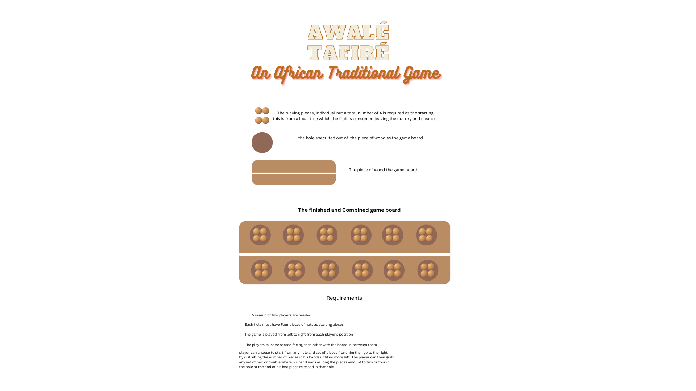
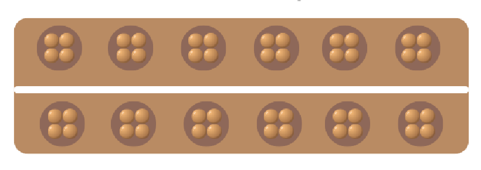

# The Awalé GAME 

 

  
  

Awalé are very simple, and the game is easy to understand. On the other hand, the strategies to be successful can be complex and subtle.a group of round objects. The aim of Awalé is to collect more seeds than your opponent. The board is divided into two sections, each with six holes. At the start, 48 seeds are placed in the 12 holes, four in each. Players take turns, with the first one chosen randomly. The player takes all the seeds from a hole in their area and distributes them counterclockwise, one in each hole. If the last seed falls into an opponent's hole that already has one or two seeds, the player captures the two or three seeds. If the player captures two or three seeds, and the preceding hole also has two or three, they are captured too. If the number of seeds taken is more than 11, it's called a 'loop'. A player must always leave at least one seed to the opponent. The game ends when one of the two players can no longer continue playing, or one quits. The player with the most seeds wins.

# The Rules of Awalé

## Rule 1 : Aim of the game
The aim of the game is to capture more seeds than your opponent. At the end of the game, the player who has captured the most seeds wins.

## Rule 2 : The board
The board is divided into two areas, hollowed with six holes each.
At the beginning, 48 seeds are distributed among the 12 holes (four seeds in each hole).

## Rule 3 : The game turn.
Every player plays alternately, the first one to play is chosen at random.
The player takes all the seeds in a hole of his area and distributes them counterclockwise, one in each hole.

## Rule 4 : Capture
If the last seed to be distributed falls into one of the opponent's holes, containing already one or two seeds, the player captures the two or three seeds. The captured seeds are taken off the board (the hole is left empty) and collected into the player's loft.

## Rule 5: Multiple capture
If a player captures two or three seeds, and the preceding hole also contains two or three seeds, they are captured too, and so on.

## Rule 6: Loop
If the number of seeds taken in the starting hole is greater than 11, it constitutes a loop : the starting hole is left out every time in the distribution loop, and therefore always left empty.

## Rule 7: Feed the opponent
A player isn't allowed to "starve" his opponent:
a player can't play a hole that leads to capturing all the seeds in his opponent's area.

## Rule 8: End of the game
The game ends if A player hasn't any seeds in his area, and therefore can't play. In this case, the other player captures all the remaining seeds.
The game is "looping", i.e. after some turns, the same play board configuration is obtained again.
In this case, the remaining seeds aren't captured.
One of the players quits the game. The other player captures all the remaining seeds.

## Resources
[https://w3schools.com]
[https://africaimports.com/]